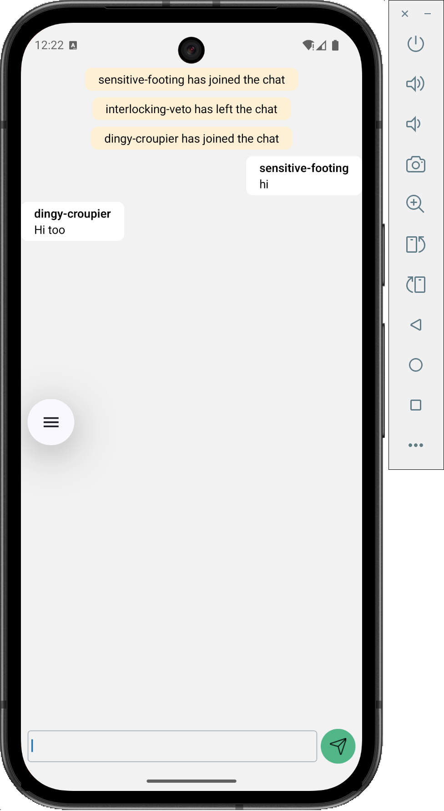

# Anon Chat

Anon Chat is a simple anonymous chat application with:
- A Rust backend using Tokio and Warp for a WebSocket chat server
- A React Native mobile app built with Expo Router as the client

This repository contains both parts:
- Backend server: [`be`](file:///Users/appfuxionconsulting/Documents/_learn/rust/anon_chat/be)
- Mobile client: [`mobile`](file:///Users/appfuxionconsulting/Documents/_learn/rust/anon_chat/mobile)

## Preview

### Screenshot



### Demo Video

[Demo Video (MOV)](readme-assets/video.mov)

> Tip: On Git hosting providers that support it, the video link can usually be played in the browser.

## Architecture

- **Backend (Rust)**
  - Located in [`be`](file:///Users/appfuxionconsulting/Documents/_learn/rust/anon_chat/be)
  - Uses:
    - `tokio` as the async runtime
    - `warp` as the HTTP/WebSocket server framework
    - `serde` / `serde_json` for JSON serialization
    - `uuid` for identifiers
  - Exposes a WebSocket endpoint:
    - `ws://<HOST>:3030/ws?username=<name>`
  - Manages connected users in memory and broadcasts messages to everyone.

- **Mobile (Expo / React Native)**
  - Located in [`mobile`](file:///Users/appfuxionconsulting/Documents/_learn/rust/anon_chat/mobile)
  - Built with Expo Router (file-based routing)
  - Connects to the backend WebSocket endpoint and renders a simple chat UI
  - Anonymous usernames are generated on the client

## Running the Backend

Requirements:
- Rust toolchain (cargo)

Steps:

```bash
cd be
cargo run
```

By default, the server:
- Listens on `127.0.0.1:3030`
- Exposes WebSocket at `ws://127.0.0.1:3030/ws?username=<name>`

If you run the mobile app on a device or simulator, make sure the server’s host/IP in the mobile app matches where the backend is actually reachable from that device (for example, your machine’s LAN IP instead of `127.0.0.1`).

## Running the Mobile App

Requirements:
- Node.js and npm
- Expo CLI (via `npx expo` or globally)

Install dependencies:

```bash
cd mobile
npm install
```

Start the Expo development server:

```bash
cd mobile
npx expo start
```

You can then open the app in:
- iOS simulator
- Android emulator
- Physical device via Expo Go

### Configuring the WebSocket URL

The mobile app connects to the backend using a constant in the chat screen:

- File: [`mobile/app/chat/index.tsx`](file:///Users/appfuxionconsulting/Documents/_learn/rust/anon_chat/mobile/app/chat/index.tsx)
- Constant:

```ts
const SERVER_URL = 'ws://10.164.186.97:3030';
```

Change `SERVER_URL` to match your backend:
- For iOS simulator: often `ws://127.0.0.1:3030` or `ws://localhost:3030`
- For physical devices: use your computer’s LAN IP, e.g. `ws://192.168.x.x:3030`

## Formatting and Linting

### Mobile

- ESLint is configured via [`eslint.config.js`](file:///Users/appfuxionconsulting/Documents/_learn/rust/anon_chat/mobile/eslint.config.js).
- Prettier is configured for auto-formatting:
  - Config: [`mobile/.prettierrc.json`](file:///Users/appfuxionconsulting/Documents/_learn/rust/anon_chat/mobile/.prettierrc.json)
  - Ignore: [`mobile/.prettierignore`](file:///Users/appfuxionconsulting/Documents/_learn/rust/anon_chat/mobile/.prettierignore)

Useful scripts (from [`mobile/package.json`](file:///Users/appfuxionconsulting/Documents/_learn/rust/anon_chat/mobile/package.json)):

```bash
cd mobile

# Lint
npm run lint

# Format code with Prettier
npm run format

# Check formatting (CI-friendly)
npm run format:check
```

VS Code settings under [`mobile/.vscode`](file:///Users/appfuxionconsulting/Documents/_learn/rust/anon_chat/mobile/.vscode) enable Prettier as the default formatter and format-on-save for JS/TS/TSX.

### Backend

You can use standard Rust tooling:

```bash
cd be

# Build
cargo build

# Run
cargo run
```

Add `cargo fmt` / `cargo clippy` as needed if you want stricter formatting and linting for the backend.

## Project Structure

```text
anon_chat/
├─ be/                  # Rust WebSocket backend (Tokio + Warp)
│  ├─ src/
│  └─ Cargo.toml
├─ mobile/              # Expo React Native mobile app
│  ├─ app/              # Expo Router routes
│  ├─ components/       # Reusable UI components
│  ├─ assets/           # Images and other assets
│  └─ package.json
└─ readme-assets/       # Assets used in this README
   ├─ screenshot.png
   └─ video.mov
```
